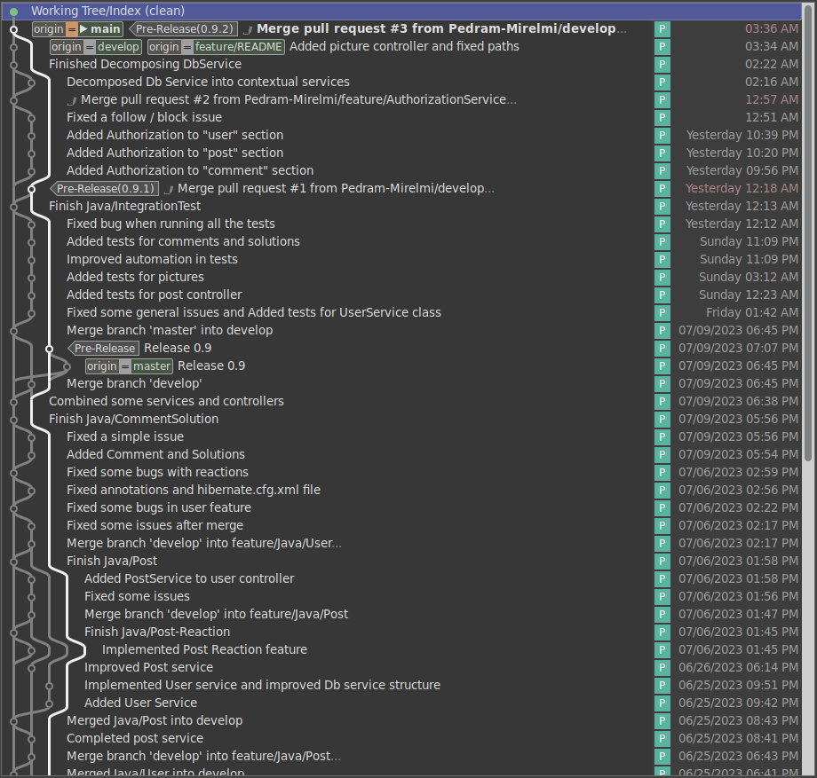
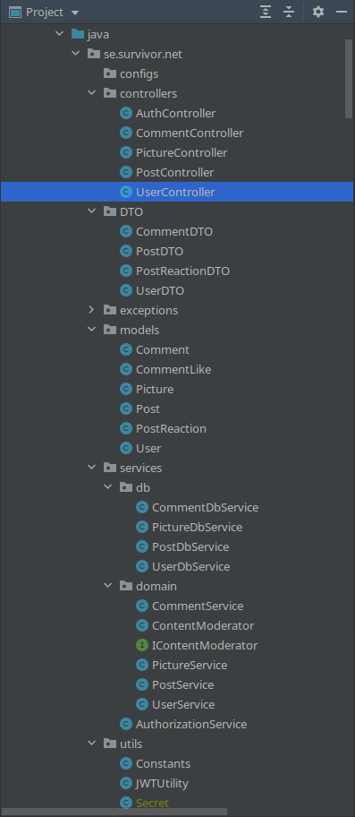
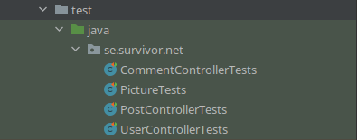

<div style="display:flex">
    
</div>

# Introduction 
There is a growing demand for platforms that promote mental health and well-being by connecting people facing similar challenges in life. Survivor Network is an open source novel and unique social media application designed to create a supportive community for individuals who are struggling with various life challenges. The app combines features from popular social media platforms like Instagram and Twitter, allowing users to follow each other, post their personal struggles, and share solutions that they've tried, using **tree structure**. Traditional social media platforms often emphasize happy moments, which may lead to feelings of inadequacy or isolation for those struggling with various issues. The primary goal of Survivor is to promote mental health and well-being by showing that life is not just about happy moments, and by connecting people who are facing similar challenges.
<br />
<br />

### features:

 - **User registration and authentication manually or using GitHub**
<div style="display:flex">
    
    
</div>


<br />
<br />

- **Home page: your follower posts are shown here. You can like them, add commend, and add solutions!**

<div style="display:flex">
    
    
</div>

<br />
<br />

- **Anyone has a profile that is Personalized and editable.**
**Sharing posts sequentially and in tree structure which is the main goal of Survivor Network is possible here.**
<div style="display:flex">
    
</div>


<br />
<br />

- **You can search people by username. You are free to visit their personal profile, list of their followers, and following. following, unfollowing, blocking, and unblocking people are other available features.**

<div style="display:flex">
    
    
</div>


<br />
<br />

# what's up in the next releases?
We are still working on this project. It's the primary version and does not even have a front end! Some features are coming soon in the next releases:
- frontend based on the figma(لینکش رو بذار)
- password recovery
- sending verification code
- change password
- quote of the day
- trending
- follow suggestion
- content moderate
- trending
- FQA
- reporting technical issues
see the preview here(دوباره لینک figma)

# What we passed during designing and developing...
Survivor Network's starting point is a software engineering course project as a new idea for improving human life quality. Every rule of software engineering is obeyed.
- Requirements are specified: they are explained before in this README file.
- Functional and non-functional requirements are defined
- We had analysed it by drawing [**activity diagram**](https://github.com/Pedram-Mirelmi/SurvivorNet/blob/feature/README/img/ActivityDiagram.png) and [**use case diagram**](https://github.com/Pedram-Mirelmi/SurvivorNet/blob/feature/README/img/UseCaseDiagram.png)


<div style="display:flex">
    <figcaption>Use Case Diagram 
    <br>
    
</div>


<br />
<br />

- We have designed [**class diagram1**](https://github.com/Pedram-Mirelmi/SurvivorNet/blob/feature/README/img/ClassDiagramObjects.png), [**class diagram2**](https://github.com/Pedram-Mirelmi/SurvivorNet/blob/feature/README/img/ClassDiagramsServicesandController.png), and [**sequence diagram**](https://github.com/Pedram-Mirelmi/SurvivorNet/blob/feature/README/img/SequenceDiagram.png) too.
\
**Tip:** The diagrams are not 100% compatible with the implementation just like any other software engineering project.


# Technologies
## Java
Java: A popular programming language used to build a wide range of applications, from web and mobile apps to desktop software and enterprise systems.

## Maven (build system)
Maven is a Java-based build automation and project management tool. It helps manage project dependencies, automate the build process, and standardize project structure and best practices. Maven is highly extensible through its plugin architecture, making it easy to integrate with other tools and systems.

## Spring Boot

Spring is by far the most popular framework in Java! Now Spring Boot which is on top of Spring is a popular framework for building web applications. It provides a wide range of features, including dependency injection, web MVC, and data access, among others.
#### Benifits:
- Easy to use: Spring Boot provides a simple and intuitive way to configure and build applications, making it easy to get started with minimal setup and configuration.
- Rapid development: Spring Boot includes many built-in features and modules that can help you quickly develop and deploy web applications, such as the Spring Framework, embedded servers, and auto-configuration. 
- Increased productivity: By providing a set of opinionated defaults and a streamlined development experience, Spring Boot can help developers be more productive.


## Hibernate (Object-Relational Mapping (ORM))
An Object-Relational Mapping (ORM) tool that allows us to map Java objects to relational database tables. It provides a high-level API for interacting with databases, making it easier to manage database operations in your Java code.
#### Benifits:
- **Maintainablity** and **Rapid development**
- Simplified data access: ORM frameworks such as Hibernate provide a simplified way to interact with databases, allowing developers to focus on the application logic rather than the underlying database schema.
- Database portability: Because ORM abstracts the database schema, it can make it easier to switch to a different database system without having to modify the application code.

**So we make use of a lot of code and architechture reuse** by using these greate frameworks and libraries which also help a lot on **quick and incremental development and delivery**! By using these framework we've kind of applies the **Integration and Configuration** method in software process models.

# Dependencies, Build and Run
### Postgres (DBMS)
Before anything you need a DBMS like Postgres(Other DBMSs require futher configurations)
1. On Manjaro and Arch-based linux systems you can install it by running the following command:<br>
```$ sudo pacman -S postgresql```<br>
2. On Debian-based linux systems:<br>
```$ sudo apt install postgresql```

How after installation a short configuration is required.

### Java and corresponding modules
1. [Recommended] Undoubtedly the best and easiest way to run such 
projects is to use some IDE [Intellij is recommended] and the project will take care of all the job!
2. However without using an IDE you need to go through theese steps in Manjaro linux system
    1. Install java by running: <br>
    ```$ sudo pacman -S jdk-openjdk  jre-openjdk```
### Maven
Next you need to Install Maven: <br>
```$ sudo pamac install maven```

## Build
To build the project all you need to do is to use meven and build project by running these two commands: <br>
```$ mvn compile```
```$ mvn package```
#### This will also trigger maven to run all the tests it can find and run theme before building!

## Run!
To run the project you just need to run the following command:<br>
```$ java -jar ./target/survivor-net-0.0.1-SNAPSHOT.jar```

# Version controll approach
In this project we used **Git flow** approach for development in which we have a `main` branch and a `develop` from it. Everytime we want to add a feature we create a branch from develop and call it `feature/{feature-name}` and when finished we merge it to develop <br>
At the end whenever the project reached an acceptable and stable version we merge `develop` into `main`
<center>


history of the `main` branch
</center>


# Structure and Architechture
The most noticable structural pattern used in this project is a **Layered and Client-Server** Architechture and **MVC** design pattern. Also thanks to Spring, we have Singletone design pattern for all of out services. Here's a general picture of the layers:
<center> 

|           |
| ------------- |
| <font size=4>  Views </font> Rendered in browser(front-end is under development)|
| <font size=4> RestControllers  </font> e.g. UserController|
| <font size=4> Domain Services</font> e.g. CommentService  |
| <font size=4> Database-connected Services </font> e.g. CommentDbService |
| <font size=4>  ORM and Hibernate Entities</font> e.g. Comment |
| <font size=4>  Postgres DBMS  </font>|

</center>

## Directory structure 
Project's directory structures follows the best conventions:
<center> 



</center>


### controllers
___
In this package all the classes has been annotated with `@RestController`and are responsible for receiving user's requests and pass to the buttom layer which are domain services

### DTO
___ 
In this package some `DTO` (Data-Transfer-Object) classes has been defined for the ease of transfering and converting database object models to upper layers
for example `UserDTO` class doesn't have `password` field and some sensetive fields. Also `Post` contains the number of `comments` and `reactions`

### exceptions
___
In this package some custom exceptions and one exception handler has been defined for the purpose of exception handling

### models
___ 
In this package all our model and ORM entities are defined such as `User` and `Post`

### services
___
This package contains all the domain and database-connected services in addition to the `AuthorizationService` <br>
Domain services are in **domain** subpackage and database-connected services are in **db** subpackage

The `ContentModerator` service is under development

### utils
___
This package contains all the utility classes needed by the project like `JWTUtility` class, some constants defined in `Constants` class and a `Secret` class that contains some secret tokens for oauth and jwt token generation

# Tests
There are some automated integrations tests for each of the 4 essential services in the test directory:
- CommentControllerTests
- PictureTests
- PostControllerTests
- UserControllerTests



