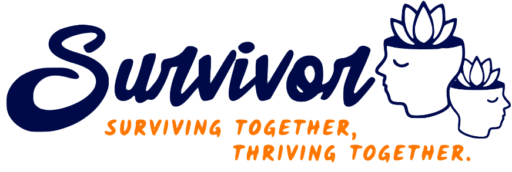

    

# Introduction 
There is a growing demand for platforms that promote mental health and well-being by connecting people facing similar challenges in life. Survivor Network is an open source novel and unique social media application designed to create a supportive community for individuals who are struggling with various life challenges. The app combines features from popular social media platforms like Instagram and Twitter, allowing users to follow each other, post their personal struggles, and share solutions that they've tried, using **tree structure**. Traditional social media platforms often emphasize happy moments, which may lead to feelings of inadequacy or isolation for those struggling with various issues. The primary goal of Survivor is to promote mental health and well-being by showing that life is not just about happy moments, and by connecting people who are facing similar challenges.
 
 

### features:

 - **User registration and authentication manually or using GitHub**

    
    

 
 

- **Home page: your follower posts are shown here. You can like them, add commend, and add solutions!**

    
    

 
 

- **Anyone has a profile that is Personalized and editable.**
**Sharing posts sequentially and in tree structure which is the main goal of Survivor Network is possible here.**

    

 
 

- **You can search people by username. You are free to visit their personal profile, list of their followers, and following. following, unfollowing, blocking, and unblocking people are other available features.**

    
    

 
 

# what's up in the next releases?
We are still working on this project. It's the primary version and does not even have a front end! Some features are coming soon in the next releases:
- frontend based on the figma(لینکش رو بذار)
- password recovery
- sending verification code
- change password
- quote of the day
- trending
- follow suggestion
- content moderate
- trending
- FQA
- reporting technical issues
see the preview here(دوباره لینک figma)

# What we passed during designing and developing...
Survivor Network's starting point is a software engineering course project as a new idea for improving human life quality. Every rule of software engineering is obeyed.
- Requirements are specified: they are explained before in this README file.
- Functional and non-functional requirements are defined
- We had analysed it by drawing [**activity diagram**](https://github.com/Pedram-Mirelmi/SurvivorNet/blob/feature/README/img/ActivityDiagram.png) and [**use case diagram**](https://github.com/Pedram-Mirelmi/SurvivorNet/blob/feature/README/img/UseCaseDiagram.png)

    <figcaption>Use Case Diagram 
     
    

 
 

- We have designed [**class diagram1**](https://github.com/Pedram-Mirelmi/SurvivorNet/blob/feature/README/img/ClassDiagramObjects.png), [**class diagram2**](https://github.com/Pedram-Mirelmi/SurvivorNet/blob/feature/README/img/ClassDiagramsServicesandController.png), and [**sequence diagram**](https://github.com/Pedram-Mirelmi/SurvivorNet/blob/feature/README/img/SequenceDiagram.png) too.
\
**Tip:** The diagrams are not 100% compatible with the implementation just like any other software engineering project.

